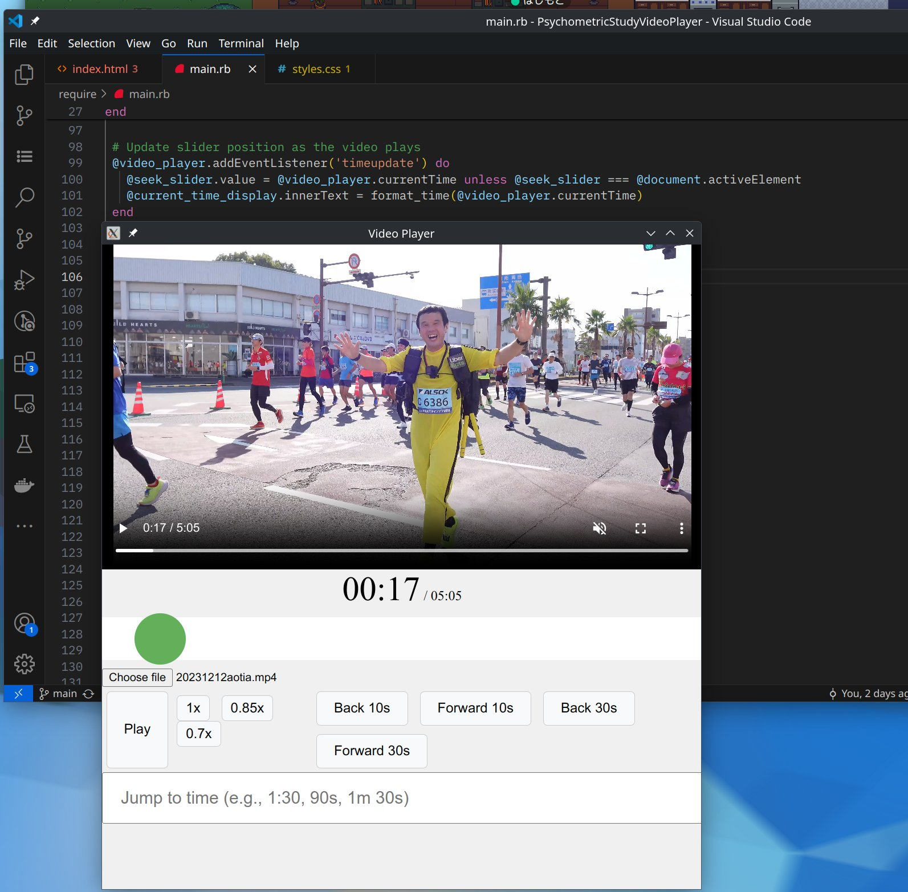

# Video Player using Ruby.wasm and Electron

This video player works in the browser but also as a standalone app. It was made for a very specific task in academia.



## How to run 

### webserver:

```
git clone https://github.com/Largo/PsychometricStudyVideoPlayer
gem install webrick
./serve.sh
```

open localhost:8080 in your browser

### Electron

```
npm install -g yarn
yarn install 
yarn run
```

## build ruby.wasm
Not necessary, because ruby-app.wasm comes included.

```
git clone https://github.com/Largo/PsychometricStudyVideoPlayer
cd PsychometricStudyVideoPlayer
git clone --recurse-submodules https://github.com/largo/ruby.wasm
rustup default stable
npm install @bytecodealliance/jco
cargo install --locked wasm-tools
./build.sh
```